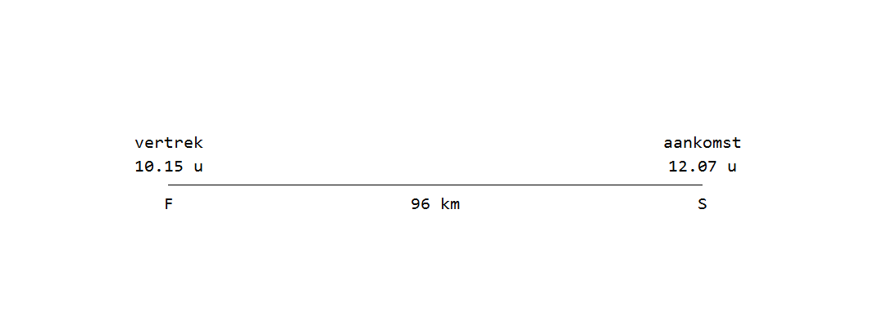

##Vraag

Shamir vertrok uit F met een gemiddelde snelheid van 80 km/u naar S.  
Onderweg rustte hij even uit.

Hoe lang heeft hij uitgerust?

A: 32 minuten  
B: 40 minuten  
C: 62 minuten  
D: 80 minuten

##Achtergrond Informatie
**Snelheid** wordt vaak uitgedrukt in **km/u** (kilometer per uur).  
Een snelheid van 80 km/u betekent dat Shamir in één uur 80 kilometer aflegt.  
De meest belangrijke formule voor dit soort somen is de volgende:

!!! Note "Tijd = Afstand : Snelheid"
    Bijvoorbeeld, je rijdt in een auto met een snelheid van 80 km/u  
    en je wilt weten hoe lang het duurt om 120 km rijden.

    afstand = 120 km  
    snelheid = 80 km/u  
    Dus de tijd is 120 : 80 = 1.5 uur

    
Verder moet je weten dat een uur bestaat uit 60 minuten.  
Bijvoorbeeld, 1.5 uur is 1 uur en 30 (0.5 x 60) minuten.

##Oplossing

De vraag is: hoe lang heeft Shamir uitgerust onderweg van F naar S?

### Stap 1: Bereken hoe lang hij onderweg zou zijn als hij geen pauze had genomen.

We gebruiken de formule tijd = afstand : snelheid.  
Afstand = 96 km  
Snelheid = 80 km/u  
Tijd = 96 : 80

$$\frac{96}{80}=\frac{48}{40}=\frac{12}{10}=\frac{6}{5}=1\frac15$$

1\(\frac15\) uur is gelijk aan 1 uur en 12 (60:5) minuten.
Shamir zou zonder pauze dus 1 uur en 12 minuten onderweg zijn.  

### Stap 1: Bereken hoe lang Shamir werkelijk onderweg was.

