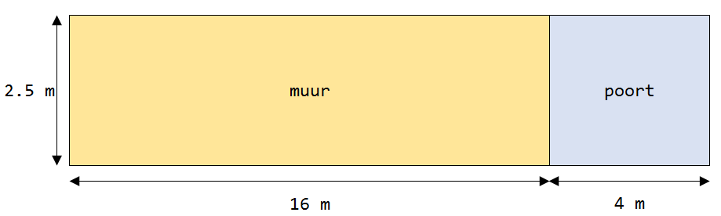

##Vraag

Alleen de muur wordt aan de voor- en achterkant geschilderd.  
Hoeveel vierkante meter wordt geschilderd?

A: 40 m2  
B: 74 m2  
C: 80 m2  
D: 100 m2

##Achtergrond Informatie
Een **meter** is een **lengte** maat. Een huis kan bijvoorbeeld 4 meter hoog zijn, of een voetbalveld kan 100 meter lang zijn.

Een **vierkante meter** is een **oppervlakte** maat. Je slaapkamer is bijvoorbeeld misschien 8 vierkante meter groot, en je bureau is 1 vierkante meter.

Om een oppervlakte van een rechthoek zoals een muur te berekenen vermenigvuldig je de lengte met de hoogte: **oppervlakte = lengte x hoogte**. 

Om de oppervlakte van een rechthoek zoals een voetbalveld te berekenen vermenig vuldig je de lengte met de breedte: **oppervlakte = lengte x breedte**

##Oplossing
De vraag is: wat is de oppervlakte van de voorkant en de achterkant van de muur bij elkaar opgeteld?

###Stap 1: bereken de oppervlakte van de voorkant van de muur

De lengte is 16m  
De hoogte is \(2\frac12\) meter  
De oppervlakte van de voorkant is dus 16 x \(2\frac12\) = 40 m2

!!! Tip
    Om 16 x \(2\frac12\) te berekenen kan je de som in stukjes oplossen:  
    16 x 2 = 32  
    16 x  \(\frac12\) = 8  
    32 + 8 = 40

###Stap 2: bereken de oppervlakte van de voor  en achterkant van de muur

De voorkant en de achterkant van de muur zijn even groot  
De voorkant en de achterkant zijn dus elk 40 m2  
In totaal moet er dus **40 + 40 = 80 m2** geschilderd worden.  
Het juiste antwoord is dus C 